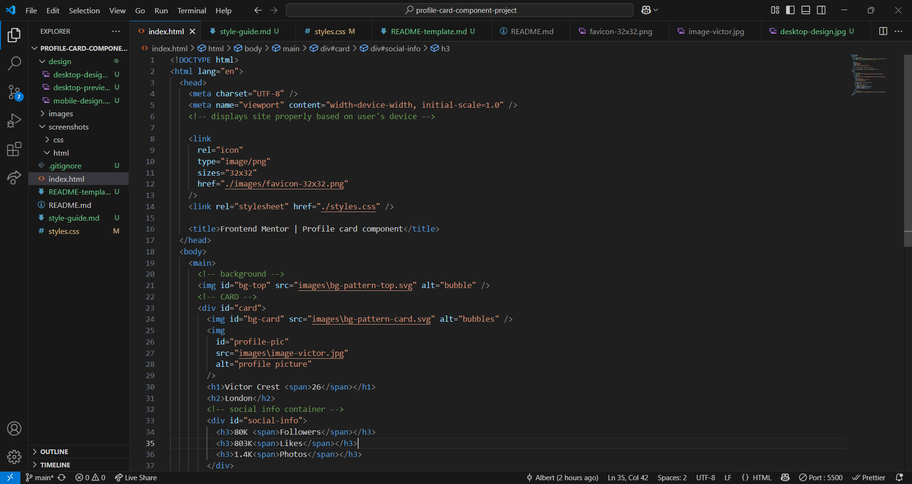
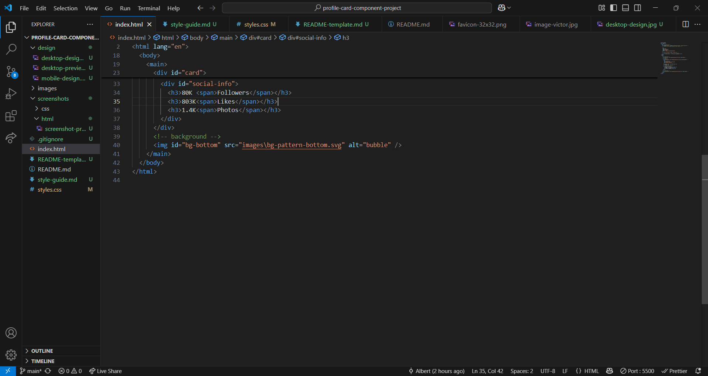
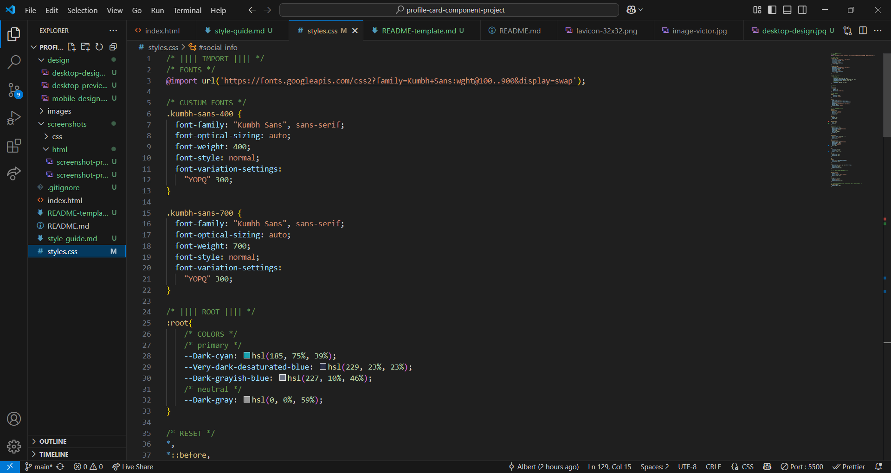
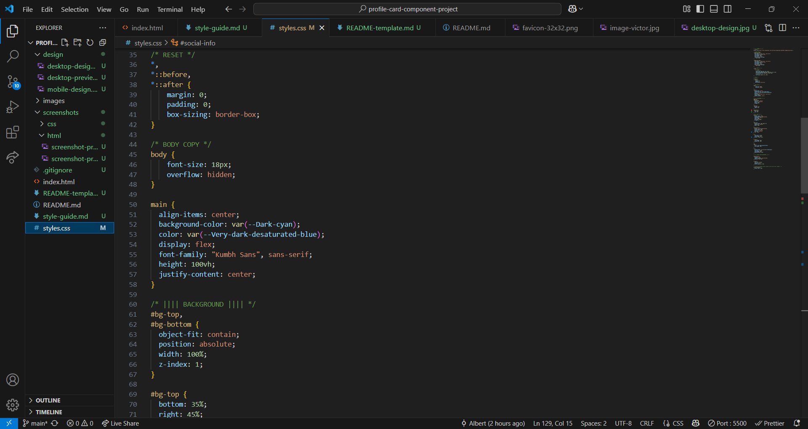
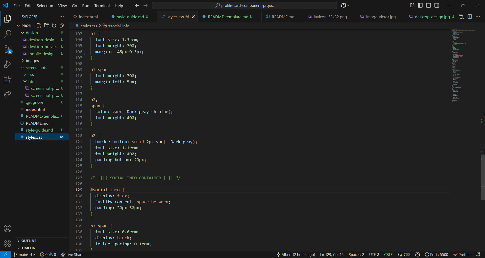
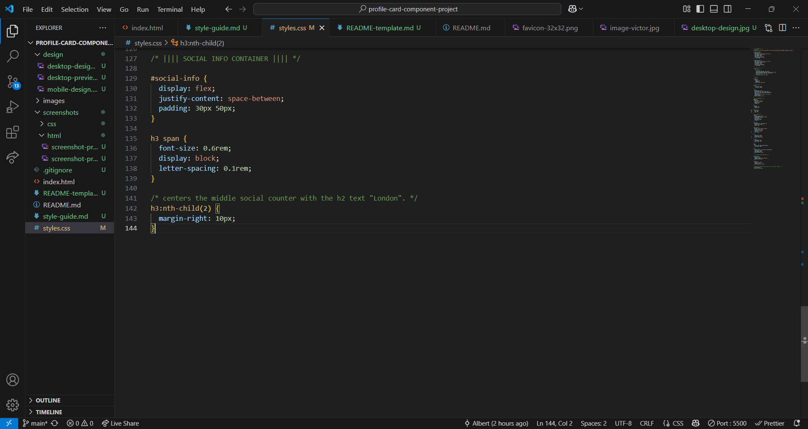

# Frontend Mentor - Profile card component solution

This is a solution to the [Profile card component challenge on Frontend Mentor](https://www.frontendmentor.io/challenges/profile-card-component-cfArpWshJ). Frontend Mentor challenges help you improve your coding skills by building realistic projects.

## Table of contents

- [Overview](#overview)
  - [The challenge](#the-challenge)
  - [Screenshot](#screenshot)
  - [Links](#links)
- [My process](#my-process)
  - [Built with](#built-with)
  - [What I learned](#what-i-learned)
  - [Continued development](#continued-development)
  - [Useful resources](#useful-resources)
- [Author](#author)
- [Acknowledgments](#acknowledgments)

## Overview

### The challenge

- Build out the project to the designs provided

### Screenshot

HTML


CSS






### Links

- Solution URL: [GitHub](https://github.com/BertSki90/profile-card-component-project)
- Live Site URL: [GitHub Pages](https://bertski90.github.io/profile-card-component-project/)

## My process

### Built with

- Semantic HTML5 markup
- CSS custom properties
- Flexbox
- Mobile-first workflow

### What I learned

I learned about working with images. Great practice moving the background images around. I got to work with CSS properties such as position, bottom, top, left, and right.

The code below represents the background images:
(The code for the card had been replaced by "..." to focus on the background images.)

```html
<body>
  <main>
    <!-- background -->
    
    <!-- CARD -->
    <div id="card">...</div>
    <!-- background -->
    
  </main>
</body>
```

```css
/* |||| BACKGROUND |||| */
#bg-top,
#bg-bottom {
  object-fit: contain;
  position: absolute;
  width: 100%;
  z-index: 1;
}

#bg-top {
  bottom: 35%;
  right: 45%;
}

#bg-bottom {
  top: 50%;
  left: 42%;
}
```

Working on the followers, likes, and photos section of the card I got to practice with "display: flex;". I had to adjust the the "likes" element to have it display center underneath the "London" element. Here is the code below:

```html
<h2>London</h2>
<!-- social info container -->
<div id="social-info">
  <h3>80K <span>Followers</span></h3>
  <h3>803K<span>Likes</span></h3>
  <h3>1.4K<span>Photos</span></h3>
</div>
```

```css
/* |||| SOCIAL INFO CONTAINER |||| */

#social-info {
  display: flex;
  justify-content: space-between;
  padding: 30px 50px;
}

h3 span {
  font-size: 0.6rem;
  display: block;
  letter-spacing: 0.1rem;
}

/* centers the middle social counter with the h2 text "London". */
h3:nth-child(2) {
  margin-right: 10px;
}
```

### Continued development

My background images are not 100%. I am not sure if there is an important property that I have missed or if it is just that my values are not bang on because I am using the .JPG files. Either way I will be reading more about working with images.

Using flex even a little helps build more confidence in my coding abilities.

I am excited to continue to keep practicing to build upon these skills.

### Useful resources

- This is the first project that I did not need to dig as deep into articles. The biggest issue I had was with the background images. I played around with many properties and values that I have seen before. The practice from Frontend Mentor is very impressive. Thank you!

## Author

- Website - [GitHub Pages](https://bertski90.github.io/profile-card-component-project/)
- Frontend Mentor - [@BertSki90](https://www.frontendmentor.io/profile/BertSki90)
- Twitter - [@BertSki90](https://x.com/BertSki90)

## Acknowledgments

Frontend Mentor and FreeCodeCamp, thank you! Frontend Mentor forces me to look broader for articles that will help complete the project. FreeCodeCamp is where I got first when I have questions. It has a great curriculum and a large library of articles.
